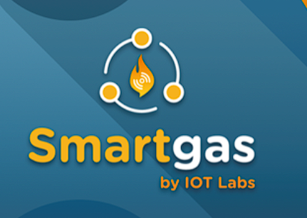

# Requirements Elicitations & Analysis

Esta etapa es fundamental en el desarrollo de nuestro sistema, ya que permite identificar, comprender y definir las necesidades reales de los usuarios y del negocio. En esta fase, se recopila información a partir de diferentes fuentes, como entrevistas, observación y análisis del contexto, con el objetivo de obtener una visión clara de los problemas existentes y las funcionalidades que la solución debe cubrir.

## **2.1. Competidores**

### **Competidor 1: IoT Smart Gas Platform**

**IoT Smart Gas** es una solución tecnológica basada en IoT que permite monitorear balones y tanques de gas en tiempo real mediante sensores conectados. Sus funcionalidades incluyen la medición de niveles de gas, presión y consumo, así como la visualización de datos a través de plataformas web o móviles, facilitando la gestión de inventario y la planificación de reposiciones. Es un competidor directo frente a nuestra startup, ya que también ofrece monitoreo y seguimiento en tiempo real; sin embargo, su enfoque está centrado principalmente en el consumo y control del suministro de gas, y no abarca de manera integral aspectos como la seguridad en almacenes mediante sensores ambientales, la gestión de cobranzas o el control completo de la distribución, que sí forman parte de la propuesta de Regula.

### **Competidor 2: GasSense (innovateIT – Smart LPG Monitoring)**

**GasSense** permite monitorear balones de gas en tiempo real mediante sensores inteligentes. Sus funcionalidades incluyen la medición del nivel de gas, generación de alertas cuando el contenido es bajo, análisis del consumo y visualización de datos a través de una plataforma web o aplicación móvil. Está orientado tanto a usuarios domésticos como a entornos industriales, buscando optimizar el uso y disponibilidad del gas. Es un competidor directo frente a nuestra startup, ya que también integra monitoreo en tiempo real y análisis de datos; sin embargo, su alcance se limita principalmente al seguimiento del estado del gas a nivel de consumo, sin integrar una solución enfocada en la operación del negocio, como la coordinación de distribución, el registro de movimientos de inventario o la administración financiera de los clientes.

### **Competidor 3: .one Meter (plataforma LPG de Aton)**

**.one Meter** es una solución empresarial orientada al sector energético que permite supervisar grandes volúmenes de balones y tanques de gas mediante tecnologías como IoT y RFID. Su sistema centraliza información en la nube y ofrece funcionalidades como trazabilidad de activos, geolocalización de unidades de transporte, control de operaciones y análisis de datos a nivel corporativo. Está diseñada principalmente para compañías de gran escala que requieren visibilidad completa de sus procesos logísticos y operativos. En relación con nuestra startup, representa un competidor directo en el ámbito del control y seguimiento de activos; sin embargo, su enfoque está dirigido a organizaciones más grandes y complejas, con soluciones menos accesibles para distribuidores pequeños o medianos.

| **Competitive Analysis Landscape** |     |
| ---- | ----- |
|  ¿Por qué llevar a cabo este análisis? |   Este análisis se realiza para comprender a fondo los problemas del sector, identificar las necesidades reales de los usuarios y definir requisitos claros que permitan desarrollar una solución efectiva. En el caso de Regula, permite asegurar que la aplicación web responda a problemas críticos como el control de inventario, la seguridad y la gestión de cobranzas. |

## Perfil

|                       | **Regula (Startup)** | Competidor 1 – **IoT Smart Gas Platform**   | Competidor 2 – **GasSense**    | Competidor 3 – **.one Meter**    |
|-----------------------|----------------------------------|---------------------------------------------|--------------------------------|----------------------------------------|
| **Perfil / Overview** | Plataforma web orientada a empresas envasadoras y distribuidores de balones de gas que permite gestionar inventario, distribución y cobranzas, además de mejorar la seguridad mediante monitoreo ambiental con sensores de gas en almacenes. | Plataforma basada en IoT que permite monitorear balones y tanques de gas en tiempo real, enfocada en el seguimiento del consumo, niveles de gas y optimización del abastecimiento. | Sistema inteligente que utiliza sensores para supervisar el nivel de gas y generar alertas de consumo, orientado a mejorar la disponibilidad del recurso en hogares e industrias mediante análisis de datos. | Plataforma empresarial que permite el seguimiento y control de activos de gas a gran escala mediante tecnologías como IoT y RFID, ofreciendo trazabilidad, geolocalización y análisis centralizado de operaciones. |
| **Ventaja competitiva / Valor** | Ofrece una solución integral que combina gestión operativa con seguridad mediante monitoreo ambiental de gas en almacenes, todo centralizado en una aplicación web accesible y fácil de usar para empresas y distribuidores. | Su ventaja radica en el monitoreo en tiempo real del consumo y nivel de gas mediante sensores IoT, lo que permite optimizar el abastecimiento y evitar interrupciones en el suministro. | Ofrece como valor principal la predicción y control del consumo de gas a través de análisis de datos, facilitando alertas tempranas y una mejor planificación del uso del recurso. | Su ventaja competitiva es la capacidad de gestionar y supervisar grandes volúmenes de activos de gas con trazabilidad y geolocalización en tiempo real, orientado a operaciones de gran escala. |

## Perfil de Marketing

|                       | **Regula (Startup)** | Competidor 1 – **IoT Smart Gas Platform**   | Competidor 2 – **GasSense**    | Competidor 3 – **.one Meter**    |
|-----------------------|----------------------------------|---------------------------------------------|--------------------------------|----------------------------------------|
| **Mercado objetivo** | Empresas envasadoras de gas y distribuidores de balones de GLP, especialmente pequeñas y medianas empresas que necesitan mejorar su control de inventario, distribución, cobranzas y seguridad operativa. | Empresas de gas, industrias y organizaciones que buscan optimizar el abastecimiento mediante monitoreo del consumo y niveles de gas en tanques o cilindros. | Usuarios domésticos, comercios e industrias que desean controlar el consumo de gas y recibir alertas para una mejor gestión del suministro. | Grandes corporaciones del sector energético y empresas de distribución de gas que operan a gran escala y requieren soluciones avanzadas para la gestión y seguimiento de activos. |
| **Estrategias de marketing** | Estrategia enfocada en un modelo B2B, con captación directa de clientes mediante demostraciones del sistema, visitas a distribuidores y alianzas con empresas del sector gas. Se complementa con presencia digital (redes, landing page) y un enfoque en mostrar ahorro de costos, control operativo y mejora en seguridad como propuesta de valor. | Estrategia basada en marketing tecnológico, destacando innovación IoT, automatización y eficiencia operativa. Utiliza canales digitales, demostraciones del producto y contenido técnico para atraer empresas interesadas en la transformación digital. | Estrategia mixta B2C y B2B, enfocada en resaltar comodidad, control del consumo y ahorro. Utiliza marketing digital, aplicaciones móviles y comunicación directa de beneficios al usuario final. | Estrategia corporativa dirigida a grandes empresas, basada en soluciones empresariales a medida, participación en ferias del sector energético y posicionamiento como proveedor tecnológico avanzado a nivel internacional. |

## Perfil de producto

|                       | **Regula (Startup)** | Competidor 1 – **IoT Smart Gas Platform**   | Competidor 2 – **GasSense**    | Competidor 3 – **.one Meter**    |
|-----------------------|----------------------------------|---------------------------------------------|--------------------------------|----------------------------------------|
| **Productos & Servicios** | Aplicación web para gestión de inventario, distribución y cobranzas, junto con monitoreo ambiental de gas en almacenes mediante sensores y alertas en tiempo real. | Plataforma IoT con sensores para monitoreo de niveles, consumo y estado del gas, con visualización de datos en tiempo real. | Sistema de monitoreo de gas con sensores inteligentes, alertas de nivel bajo y análisis de consumo accesible desde app o web. | Plataforma empresarial para gestión de activos de gas con IoT y RFID, incluyendo trazabilidad, geolocalización y análisis de datos. |
| **Precios & Costos** | Regula utiliza un modelo SaaS basado en suscripción mensual, donde los clientes pagan por el acceso a la plataforma según su tamaño o uso. Adicionalmente, puede generar ingresos por servicios complementarios como implementación inicial y venta o integración de sensores de gas. | Opera con un modelo híbrido que combina la venta de dispositivos IoT (sensores) con suscripciones a una plataforma digital para monitoreo y gestión de datos. | Su modelo de negocio se basa en la comercialización de sensores inteligentes junto con el acceso a su sistema de monitoreo mediante suscripción, ofreciendo valor a través del análisis del consumo. | Funciona bajo un modelo empresarial que combina licencias de software, servicios personalizados e integración tecnológica, generalmente mediante contratos y suscripciones dirigidas a grandes compañías. |
| **Canales de distribución (Web y/o Móvil)** | Principalmente a través de una aplicación web, accesible desde cualquier dispositivo con internet, con posibilidad de integración futura con versión móvil. | Acceso mediante plataforma web y aplicación móvil, complementado con dispositivos físicos conectados (sensores IoT). | Uso de aplicación móvil y plataforma web para monitoreo y visualización de datos en tiempo real. | Distribución a través de plataforma web empresarial en la nube, con acceso remoto para gestión y monitoreo de operaciones. |

## Análisis SWOT

*Análisis FODA*

|                       | **Regula (Startup)** | Competidor 1 – **IoT Smart Gas Platform**   | Competidor 2 – **GasSense**    | Competidor 3 – **.one Meter**    |
|-----------------------|----------------------------------|---------------------------------------------|--------------------------------|----------------------------------------|
| **Fortalezas** | Solución integral que combina gestión operativa y seguridad, fácil de usar, accesible para PYMES y enfocada en necesidades reales del sector. | Monitoreo en tiempo real mediante IoT, automatización de datos y optimización del abastecimiento de gas. | Capacidad de análisis y predicción de consumo, con alertas inteligentes que mejoran la gestión del uso de gas. | Alta escalabilidad, trazabilidad de activos y gestión centralizada para operaciones de gran volumen. |
| **Debilidades** | Marca nueva en el mercado, menor experiencia en el sector y dependencia de adopción tecnológica por parte de usuarios tradicionales. | Dependencia de hardware (sensores) que eleva costos iniciales y enfoque limitado al monitoreo del gas, sin cubrir procesos del negocio. | Enfoque centrado en consumo y no en la gestión operativa completa, con menor utilidad para distribuidores o empresas logísticas. | Alto costo y complejidad de implementación, orientado a grandes empresas, lo que dificulta su adopción en PYMES. |
| **Oportunidades** | Creciente necesidad de digitalización en el sector, baja adopción tecnológica en distribuidores y demanda por mejorar seguridad y control operativo. | Creciente necesidad de digitalización en el sector, baja adopción tecnológica en distribuidores y demanda por mejorar seguridad y control operativo. | Mayor interés en eficiencia energética y control de consumo tanto en hogares como en industrias. | Crecimiento de grandes empresas energéticas que requieren soluciones avanzadas para optimizar sus operaciones a gran escala. |
| **Amenazas** | Competencia de soluciones tecnológicas ya posicionadas, resistencia al cambio por parte de usuarios tradicionales y posibles limitaciones en adopción por presupuesto. | Alta competencia en el mercado IoT y barreras de adopción por costos iniciales o complejidad técnica. | Saturación de soluciones similares enfocadas en consumo y dificultad para diferenciarse en el mercado. | Dependencia de grandes clientes y competencia de soluciones más accesibles que pueden captar segmentos más pequeños del mercado. |

### **2.1.2. Estrategias y tácticas frente a competidores**

- **Plan SaaS accesible:** Ofreceremos una suscripción mensual económica con funciones esenciales de gestión (inventario, distribución y cobranzas), mucho más accesible que soluciones basadas en hardware costoso o implementaciones industriales complejas.

- **Capacitación y contenido educativo:** Brindaremos guías, tutoriales y capacitaciones sobre gestión de inventario, control de distribución y seguridad en almacenes, posicionando a Regula como una solución práctica y fácil de adoptar frente a sistemas más técnicos.

- **Funciones diferenciadoras:** Incorporaremos alertas en tiempo real sobre fugas de gas en almacenes, control de deudas por cliente y seguimiento de rutas de distribución, ofreciendo una solución más completa frente a plataformas enfocadas solo en monitoreo o consumo.

- **Planes escalables:** Ofreceremos distintos niveles de suscripción según el tamaño del negocio, permitiendo a distribuidores y empresas crecer en funcionalidades sin necesidad de realizar grandes inversiones iniciales.