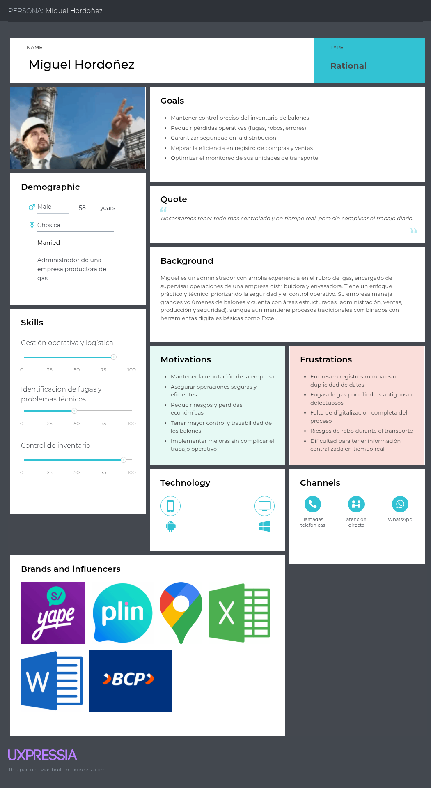

## **2.3. Needfinding**

### **2.3.1. User Personas**

Para diseñar una solución realmente útil, es fundamental entender a quién va dirigida. Por ello, se han desarrollado User Personas que representan de forma realista a nuestros dos segmentos principales: las empresas envasadoras de gas y los distribuidores de balones. Estos perfiles se construyen a partir de la información obtenida en entrevistas y análisis del contexto, reflejando sus necesidades, problemas y forma de trabajo en el día a día. De esta manera, las User Personas nos permiten tener una visión más clara del usuario, ayudando a que el diseño de la aplicación web Regula esté enfocado en resolver situaciones reales y aportar valor en sus operaciones.

Segmento Objetivo 1: Empresas de gas (productoras y distribuidoras a gran escala)

    

Miguel Hordoñez es un administrador de 58 años que trabaja en una empresa productora de gas, con amplia experiencia en la supervisión de operaciones de envasado y distribución. Su rol está más orientado a la gestión y control estratégico, manejando grandes volúmenes de balones y priorizando la seguridad, eficiencia y trazabilidad en todos los procesos.

Su principal objetivo es tener un control preciso del inventario y reducir pérdidas operativas como fugas, robos o errores en registros. Sin embargo, enfrenta problemas como la falta de digitalización completa, errores en procesos manuales y dificultad para centralizar información en tiempo real.

 
 

Segmento Objetivo 2: Distribuidores de gas (minoristas y puntos de venta)

Carlos Mendoza es un distribuidor independiente de balones de gas de 48 años, con más de 15 años de experiencia en el rubro. Maneja su negocio de forma autónoma, encargándose personalmente del inventario, las ventas y la distribución, basándose principalmente en su experiencia y en la relación de confianza con sus clientes.

Su principal objetivo es tener un mejor control de su negocio, reduciendo errores en los registros, organizando sus pedidos y aumentando sus ventas. Sin embargo, enfrenta problemas como el desorden en el seguimiento de pedidos, pérdida de tiempo en procesos manuales y dificultad para llevar control de clientes y deudas. Aunque no tiene un alto dominio tecnológico, está dispuesto a usar herramientas simples que le ayuden a trabajar de manera más rápida, ordenada y eficiente.

### **2.3.2. User Task Matrix**

En esta sección se presenta el User Task Matrix, el cual permite identificar y organizar las principales tareas que realizan los User Personas que representan a los segmentos objetivo de la solución Regula. Este análisis se enfoca en comprender cómo operan actualmente los usuarios en su día a día dentro del negocio de distribución y envasado de balones de gas.

Los segmentos considerados son:

- Segmento 1: Distribuidores independientes de balones de gas. 
- Segmento 2: Empresas envasadoras de gas.

Las tareas descritas corresponden a actividades habituales relacionadas con la gestión de inventario, distribución, control de ventas, cobranzas y seguridad operativa, las cuales se realizan muchas veces de forma manual o con herramientas básicas. Este análisis permite identificar problemas, ineficiencias y puntos críticos en los procesos actuales, así como detectar oportunidades donde Regula puede aportar valor mediante una solución digital más organizada, segura y eficiente.

**Segmento 1**

|     Task   | Frequency | Importance |
|-------------------------------------------------------------|----------|------------|
| Controlar inventario de balones (Excel + registros físicos)                        | Diaria        | Alta   |
| Supervisar procesos de envasado y calidad de cilindros.                     | Diaria       | Crítica       |
| Coordinar distribución y despacho de camiones. | Diaria      | Alta   |
| Monitorear unidades mediante GPS.                | Diaria      | Alta     |
| Registrar compras y ventas (guías de remisión / sistema). | Diaria       | Media       |
| Gestionar incidencias (fugas, robos, fallas operativas).                  | Ocasional    | Media      |

**Análisis**

Este segmento realiza operaciones de alta prioridad de forma constante, con alta dependencia en el control diario del inventario, distribución y monitoreo de unidades. Si bien cuentan con algunos sistemas como Excel o GPS, aún existen procesos parcialmente manuales que pueden generar errores o falta de integración de la información.

 

**Segmento Objetivo 2**

|     Task   | Frequency | Importance |
|-------------------------------------------------------------|----------|------------|
| Registrar ventas e inventario en cuaderno.                        | Diaria        | Critica   |
| Recibir pedidos por llamadas o WhatsApp.                     | Diaria       | Alta       |
| Coordinar y realizar entregas de balones.      | Diaria   | Alta |
| Verificar estado de los balones (fugas o defectos).     | Diaria    | Alta |
| Hacer seguimiento a clientes con deuda. | Semanal       | Media       |
| Revisar stock disponible para reabastecimiento.                  | Diaria    | Alta      |

**Análisis**

Este segmento presenta un mayor nivel de informalidad y dependencia de procesos manuales, como el uso de cuadernos y comunicación por llamadas o WhatsApp. Sus tareas son altamente frecuentes y críticas para la operación diaria, especialmente en el control de ventas, inventario y entregas. Sin embargo, enfrentan problemas de desorden, falta de seguimiento y riesgo de errores, lo que refleja una gran oportunidad para implementar una solución simple y accesible que facilite la organización, el control y la gestión del negocio.

### **2.3.3. User Journey Mapping**

En esta sección se presentan los User Journey Mapping, los cuales permiten visualizar paso a paso la experiencia de los usuarios al realizar sus actividades dentro del proceso de gestión y distribución de balones de gas. A través de estos recorridos, se identifican las acciones, puntos de contacto, dificultades y emociones que experimentan los usuarios en cada etapa. Este análisis ayuda a comprender mejor su experiencia actual y detectar oportunidades donde Regula puede intervenir para mejorar la eficiencia, organización y seguridad en sus operaciones.

**Segmento Objetivo 1: Empresas de gas (productoras y distribuidoras a gran escala)**

**Segmento Objetivo 2: Distribuidores de gas (minoristas y puntos de venta)**

 

### **2.3.4. Empathy Mapping**

