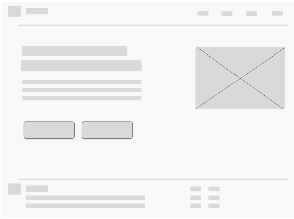

# 4.3 Landing Page UI Design

La landing page de **Regula** está diseñada siguiendo una estructura clara orientada a **User Experience (UX)** y **conversión**, comunicando la propuesta de valor del sistema de forma directa.

---

## Estructura principal

### Hero Section
- Título principal (*value proposition*)
- Descripción breve del sistema
- Botones CTA (*Call To Action*):
  - “Get Started”
  - “Learn More”
- Imagen representativa del sistema (dashboard + IoT)

---

### Problem & Solution Section
- Identificación de problemas:
  - Fugas de gas
  - Control manual
  - Falta de trazabilidad
- Presentación de la solución:
  - Monitoreo en tiempo real
  - Plataforma web centralizada

---

### Features Section
Visualización en tarjetas (*cards UI*) de funcionalidades:
- Monitoreo en tiempo real
- Registro de inventario
- Seguimiento de entregas (*tracking*)
- Alertas automáticas

---

### Pricing Section
- Planes:
  - Básico
  - Estándar
  - Premium
- Botones CTA:
  - “Choose Plan”

---

### Contact Section
- Formulario de contacto (*form UI*)
- Botón:
  - “Send” (captación de leads)

---

### Footer
- Enlaces de navegación secundaria (*footer navigation*)
- Información legal
- Redes sociales

---

## Aspectos de diseño (UI/UX)

- Diseño **responsive** (adaptable a mobile y desktop)
- Navegación intuitiva (*user-friendly navigation*)
- Uso de colores funcionales:
  - Rojo → alertas
  - Azul → acciones principales
  - Verde → confirmaciones
- Estructura basada en **jerarquía visual** (*visual hierarchy*) para facilitar la lectura

### 4.3.1. Landing Page Wireframe.
 

### 4.3.2. Landing Page Mock-up.
 

## 4.4. Web Applications UX/UI Design

El diseño UX/UI de la aplicación web de **Regula** está enfocado en facilitar el **control operativo, la supervisión de seguridad y la gestión de balones de gas** de forma rápida e intuitiva.

---

### Estructura de la Aplicación (UI)

#### **Dashboard**

* Vista principal con métricas clave (**KPIs**)
* Visualización de alertas activas, inventario y estado general

---

#### **Módulo de Inventario**

* Registro de entrada y salida de balones
* Tabla de datos (*data table*) con filtros y búsqueda

---

#### **Módulo de Alertas**

* Notificaciones en tiempo real (*real-time alerts*)
* Clasificación por nivel de riesgo (prioridad)

---

#### **Módulo de Distribución**

* Seguimiento de entregas (*tracking*)
* Visualización de rutas y ubicación

---

#### **Módulo de Reportes**

* Historial de movimientos
* Generación de reportes para análisis

---

### Aspectos UX (User Experience)

* **Interfaz intuitiva:**
  Reduce la curva de aprendizaje

* **Acceso rápido:**
  Prioridad a funciones críticas (alertas y monitoreo)

* **Eficiencia:**
  Minimización de pasos en tareas frecuentes

* **Feedback visual inmediato:**
  Confirmaciones, errores y alertas en tiempo real

---

### Aspectos UI (User Interface)

* **Diseño limpio:**
  Jerarquía visual clara (*visual hierarchy*)

* **Uso de colores funcionales:**

    * Rojo → alertas críticas
    * Amarillo → advertencias
    * Verde → estados normales

* **Componentes reutilizables:**
  Botones, tablas, formularios

* **Diseño responsive:**
  Adaptable a distintos dispositivos

---
