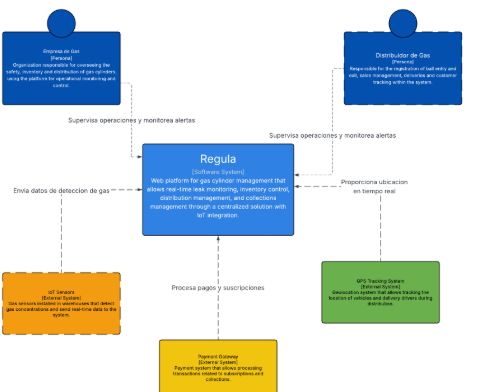
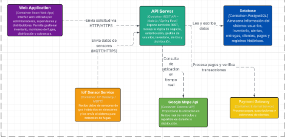
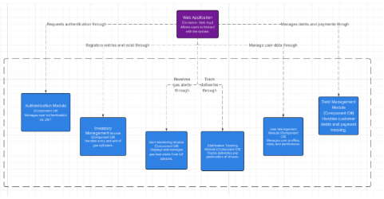

## 4.6.2. Software Architecture Context Diagram.
 
Link:  
https://lucid.app/lucidchart/5c764570-c29a-4d42-ac08-57694690f8a9/edit?viewport_loc=-1015%2C-56%2C3380%2C1499%2C0_0&invitationId=inv_6239b4a7-efd5-4663-984a-5c0f504ff08b
## 4.6.3. Software Architecture Container Diagrams.
  
Link: 
https://lucid.app/lucidchart/5c764570-c29a-4d42-ac08-57694690f8a9/edit?viewport_loc=-1015%2C-56%2C3380%2C1499%2C0_0&invitationId=inv_6239b4a7-efd5-4663-984a-5c0f504ff08b

## 4.6.4. Software Architecture Components Diagrams.
 
Link:  
https://lucid.app/lucidchart/5c764570-c29a-4d42-ac08-57694690f8a9/edit?viewport_loc=-1015%2C-56%2C3380%2C1499%2C0_0&invitationId=inv_6239b4a7-efd5-4663-984a-5c0f504ff08b

