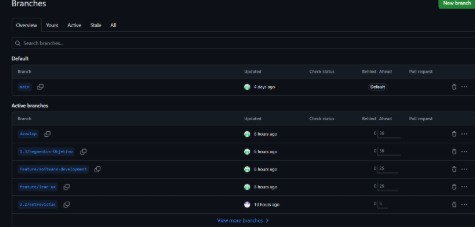
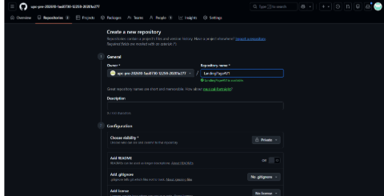
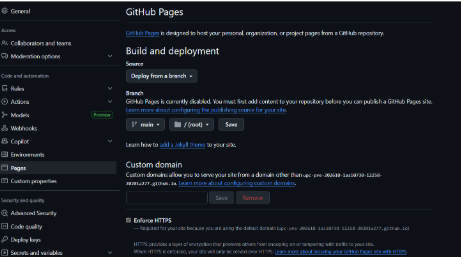

# 5.1.1. Software Development Environment Configuration.

| Tool / Software | Purpose in the Project | Access / Download |
|---|---|---|
| GitHub | Source code hosting and version control | https://github.com |
| Trello | Sprint task management | https://trello.com |
| Figma | Wireframes and mock-ups design | https://www.figma.com |
| Visual Studio Code | Landing page development | https://code.visualstudio.com |
| Google Chrome | Testing and responsive preview | https://www.google.com/chrome/ |
| Miro | Organization and event storming | https://miro.com/app/dashboard/ |
| LucidChart | Web Applications User Flow Diagrams | https://www.lucidchart.com/pages/es |

## Project Management

### Trello

**¿Por qué lo utilizamos?**  
Lo utilizamos para organizar tareas del sprint, asignarlas a los integrantes, dar seguimiento al avance y visualizar qué estaba pendiente, en proceso o terminado.

## Requirements Management

### Miro

**¿Por qué lo utilizamos?**  
Lo utilizamos para crear diagramas y representar visualmente procesos o estructuras del proyecto, como flujos, mapas o diagramas de análisis.

### UXPressia

**¿Por qué lo utilizamos?**  
Usamos UXPressia porque nos permitió crear y organizar de forma visual artefactos de análisis de usuarios, como User Personas, Journey Maps e Impact Maps, facilitando que el equipo entendiera mejor a los segmentos objetivo y mantuviera una visión compartida del usuario durante el diseño del producto.

## Product UX/UI Design

### Figma

**¿Por qué lo utilizamos?**  
Lo utilizamos para crear y compartir los wireframes, mockups y propuestas visuales del producto antes de implementarlo. También ayudó a que el equipo tuviera una referencia común del diseño.

### LucidChart

**¿Por qué lo utilizamos?**  
Usamos LucidChart porque nos permitió elaborar de manera clara y colaborativa los diagramas y flujos del proyecto, ayudando al equipo a representar visualmente procesos, relaciones y estructuras necesarias para el análisis, diseño y organización de la solución.

## Software Development

### Visual Studio Code

**¿Por qué lo utilizamos?**  
Lo utilizamos como editor de código para desarrollar el Landing Page, porque permite escribir, editar y organizar archivos HTML, CSS y JavaScript de manera práctica y rápida. Además, lo utilizamos para hacer los commits.

### Google Chrome

**¿Por qué lo utilizamos?**  
Lo utilizamos para probar el funcionamiento del Landing Page, revisar la navegación y verificar cómo se veía en diferentes tamaños de pantalla usando las herramientas del navegador.

## Software Documentation

### GitHub

**¿Por qué lo utilizamos?**  
Lo utilizamos para guardar, organizar y controlar las versiones del código fuente del proyecto. También permitió que varios integrantes trabajaran sobre el mismo proyecto sin perder cambios, además de dejar evidencia de participación mediante commits, ramas y repositorios.

## 5.1.2. Source Code Management.

GitFlow Implementation

Para aplicar el flujo de trabajo GitFlow en nuestro control de versiones con Git, tomamos como referencia el artículo “A successful Git branching model” de Vincent Driessen. Esta fuente nos ayudó a definir las convenciones que seguiremos en la organización de ramas dentro del proyecto.

# Branching Strategy & Coding Conventions

## Branching Strategy

### Main branch
La rama principal del proyecto es **main**. En ella se mantiene la versión estable del código, es decir, la que representa el estado más confiable y listo para producción del proyecto.

**Notación:** `main`

---

### Develop branch
La rama **develop** contiene los cambios y avances más recientes que todavía no forman parte de la versión final en producción. Esta rama se usa para integrar, revisar y probar nuevas modificaciones antes de incorporarlas a la rama principal.

**Notación:** `develop`

---

### Release branch
La rama **release** se utiliza para preparar una nueva versión del producto antes de su publicación. En esta rama se pueden realizar ajustes finales y correcciones necesarias, mientras la rama develop sigue recibiendo nuevos avances.

Se crea a partir de `develop` y, una vez finalizada, debe fusionarse tanto con `develop` como con `main`.

**Notación:** `release`

---

### Feature branch
Las ramas **feature** se utilizan para desarrollar nuevas funcionalidades o mejoras específicas del producto. Permiten trabajar de forma aislada sin afectar directamente el flujo principal.

Se crean desde `develop` y, al finalizar, se fusionan nuevamente en `develop`.

**Notación:** `feature`

---

### Convenciones de nombres

- Main branch: `main`
- Develop branch: `develop`
- Feature branches: `feature/<feature-name>`
- Release branches: `release/v<major>.<minor>.<patch>`
- Hotfix branches: `hotfix/<fix-name>`

---

## Conventional Commits

Conventional Commits es una convención para escribir mensajes de commit de forma clara y consistente. Facilita la lectura del historial del repositorio, mejora la comunicación del equipo y permite identificar rápidamente el tipo de cambio realizado.

### Tipos de commit

- `feat` → nueva funcionalidad
- `fix` → corrección de errores
- `docs` → cambios en documentación
- `style` → cambios de formato sin afectar lógica
- `refactor` → mejora de código sin cambiar funcionalidad
- `test` → pruebas añadidas o modificadas
- `chore` → tareas de mantenimiento
- `perf` → mejoras de rendimiento

---

## 5.1.3. Source Code Style Guide & Conventions

Como regla general, todo el código fuente estará redactado en **inglés** (variables, funciones, clases, archivos y comentarios), con el objetivo de mantener consistencia, claridad y facilidad de mantenimiento.

---

## HTML

# 5.2. Landing Page, Services & Applications Implementation

La implementación del Landing Page, los servicios y las aplicaciones representa una etapa clave dentro del desarrollo del proyecto, ya que permite convertir la propuesta diseñada en una solución real y funcional. En esta fase, las ideas, requisitos y especificaciones previamente definidos se transforman en código, dando forma a la estructura, comportamiento y servicios del producto según las necesidades identificadas.

---

## 5.2.1. Sprint 1

El Sprint 1 marca el inicio del trabajo de construcción dentro del enfoque ágil del proyecto. En esta primera iteración, el equipo se centra en desarrollar las funcionalidades más importantes definidas en la planificación inicial, llevando los requerimientos a una primera versión funcional del producto. De esta manera, se empieza a construir una base sólida de forma progresiva e incremental.

---

## 5.2.1.1. Sprint Planning 1

### Sprint #
**Sprint 1**

---

### Sprint Planning Background

| Element | Detail |
|--------|--------|
| **Date** | 2026-04-18 |
| **Time** | 11:00 PM |
| **Location** | Microsoft Teams (Virtual) |
| **Prepared By** | Ramos Cerdan Elias Daniel |
| **Attendees** | Tello Palacios, Fabrizio Rafael / Espinoza Lopez, Paul Alexandro Angel / Ramos Cerdan, Elias Daniel / Lopez Torres, Leonardo Gabriel / Lopez Montalvo, Kevin Edu |

---

### Sprint n – 1 Review Summary
Se lograron varios de los objetivos planteados para el producto, como el desarrollo de todos los capítulos del informe, el despliegue completo del Landing Page y la incorporación de la mayor parte de la información requerida en el reporte.

No obstante, una de las metas más importantes que también debía cumplirse fue la entrega del informe en formatos PDF y Word.

---

### Sprint n – 1 Retrospective Summary
El Sprint 1 fue eficiente en términos de avance y cumplimiento general; sin embargo, requirió mejoras y correcciones de último momento.

El team leader destacó oportunidades de mejora:
- Mayor compromiso por parte de todo el equipo
- Implementación de reuniones diarias
- Mejor comunicación entre los integrantes

---

### Sprint Goal & User Stories

#### Sprint n Goal
Nuestro enfoque está en lograr la primera versión funcional y desplegada del Landing Page, junto con la primera versión completa del informe correspondiente a la entrega AV1.

Creemos que esto aporta una primera presentación clara, accesible y funcional de la propuesta de valor del proyecto para los visitantes y stakeholders.

Esto se confirmará cuando:
- El Landing Page esté publicado y accesible sin problemas
- Sus secciones principales funcionen correctamente
- El informe esté finalizado en el formato requerido

---