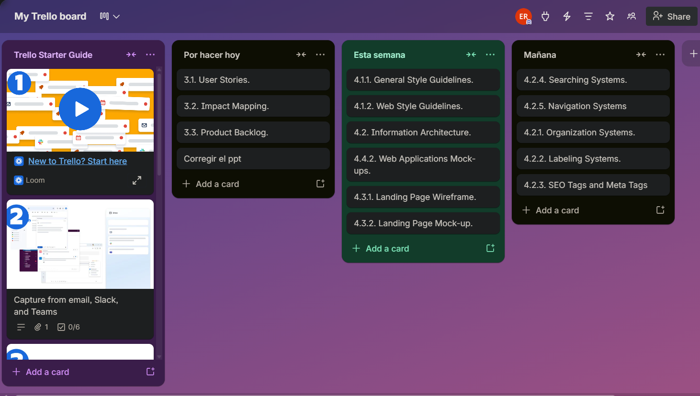
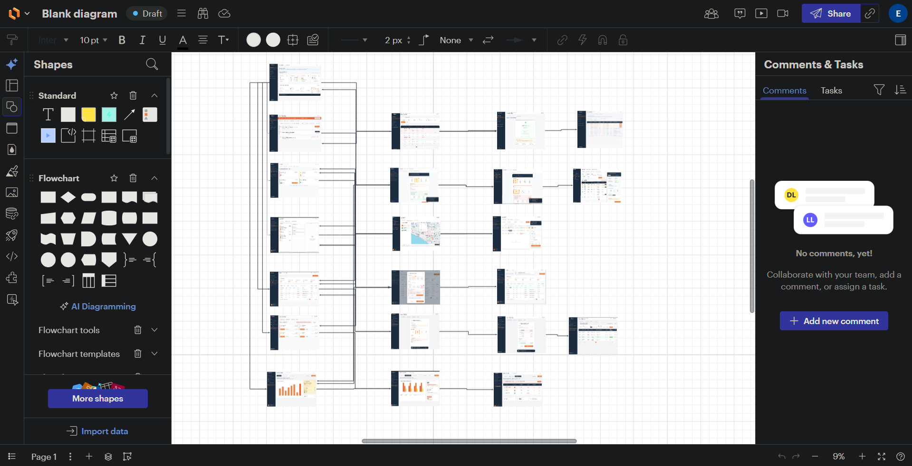
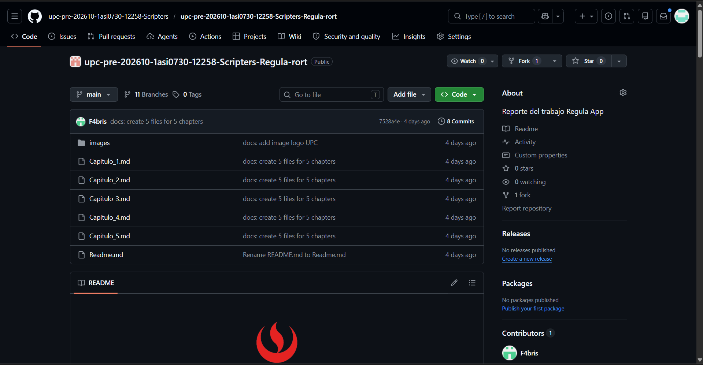

# 5.1.1. Software Development Environment Configuration.

| Tool / Software | Purpose in the Project | Access / Download |
|---|---|---|
| GitHub | Source code hosting and version control | https://github.com |
| Trello | Sprint task management | https://trello.com |
| Figma | Wireframes and mock-ups design | https://www.figma.com |
| Visual Studio Code | Landing page development | https://code.visualstudio.com |
| Google Chrome | Testing and responsive preview | https://www.google.com/chrome/ |
| Miro | Organization and event storming | https://miro.com/app/dashboard/ |
| LucidChart | Web Applications User Flow Diagrams | https://www.lucidchart.com/pages/es |

## Project Management

### Trello

**¿Por qué lo utilizamos?**  
Lo utilizamos para organizar tareas del sprint, asignarlas a los integrantes, dar seguimiento al avance y visualizar qué estaba pendiente, en proceso o terminado.

## Requirements Management

### Miro

**¿Por qué lo utilizamos?**  
Lo utilizamos para crear diagramas y representar visualmente procesos o estructuras del proyecto, como flujos, mapas o diagramas de análisis.

### UXPressia

**¿Por qué lo utilizamos?**  
Usamos UXPressia porque nos permitió crear y organizar de forma visual artefactos de análisis de usuarios, como User Personas, Journey Maps e Impact Maps, facilitando que el equipo entendiera mejor a los segmentos objetivo y mantuviera una visión compartida del usuario durante el diseño del producto.

## Product UX/UI Design

### Figma

**¿Por qué lo utilizamos?**  
Lo utilizamos para crear y compartir los wireframes, mockups y propuestas visuales del producto antes de implementarlo. También ayudó a que el equipo tuviera una referencia común del diseño.

### LucidChart

**¿Por qué lo utilizamos?**  
Usamos LucidChart porque nos permitió elaborar de manera clara y colaborativa los diagramas y flujos del proyecto, ayudando al equipo a representar visualmente procesos, relaciones y estructuras necesarias para el análisis, diseño y organización de la solución.

## Software Development

### Visual Studio Code

**¿Por qué lo utilizamos?**  
Lo utilizamos como editor de código para desarrollar el Landing Page, porque permite escribir, editar y organizar archivos HTML, CSS y JavaScript de manera práctica y rápida. Además, lo utilizamos para hacer los commits.

### Google Chrome

**¿Por qué lo utilizamos?**  
Lo utilizamos para probar el funcionamiento del Landing Page, revisar la navegación y verificar cómo se veía en diferentes tamaños de pantalla usando las herramientas del navegador.

## Software Documentation

### GitHub

**¿Por qué lo utilizamos?**  
Lo utilizamos para guardar, organizar y controlar las versiones del código fuente del proyecto. También permitió que varios integrantes trabajaran sobre el mismo proyecto sin perder cambios, además de dejar evidencia de participación mediante commits, ramas y repositorios.